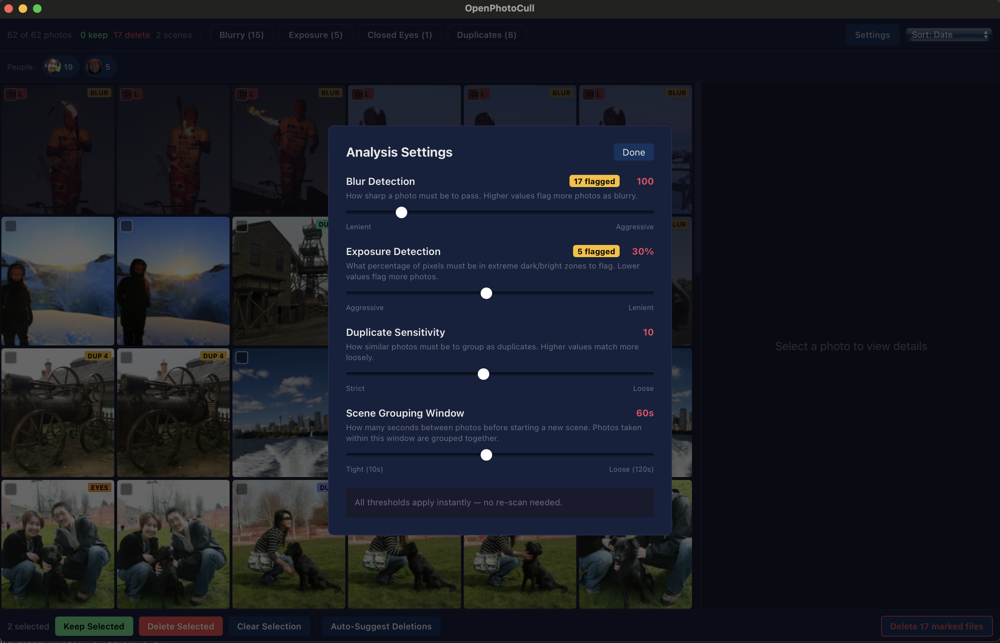

# OpenPhotoCull

A fast, open-source desktop app for photo culling. Scan a folder, automatically analyze every image for quality issues, and quickly decide what to keep or delete.

Built with Rust + Tauri v2 + React. Runs natively on macOS with cross-platform support planned for Windows and Linux.

**100% private** — every photo stays on your machine. No cloud uploads, no accounts, no telemetry, no internet connection required. Your photos are yours.

**Blazing fast** — processes 150+ images per second on Apple Silicon. A 1,000-photo shoot analyzes in under 10 seconds. Commercial alternatives charge $10-15/month and are slower.

**Free forever** — open source under the MIT license. No subscriptions, no trials, no feature gates.




## Features

### Analysis Pipeline (single-pass, ~120 images/sec)

- **Blur detection** — Tile-grid Laplacian variance plus EXIF intent flags (aperture, focal length, shutter speed). Correctly keeps shallow depth-of-field shots where the subject is sharp on a soft background, and distinguishes hand-shake blur from out-of-focus blur.
- **Subject focus detection** — Compares blur inside the subject region versus the background. Uses face bounding boxes when Vision detects a person, and falls back to class-agnostic Vision saliency for non-human subjects (dogs, products, flowers, etc.). Flags back-focused shots while preserving intentional bokeh.
- **Exposure analysis** — Luminance histogram detects underexposed, overexposed, and high-contrast images.
- **Duplicate detection** — EXIF timestamp clustering + perceptual hashing (dHash) groups near-identical shots together.
- **Closed eye detection** — Apple Vision framework detects faces and measures eye openness. Flags photos where someone blinked. *(macOS only)*
- **Face grouping by person** — Vision framework feature print embeddings clustered to identify unique people. Filter your library by person. *(macOS only)*
- **Scene grouping** — Groups temporally proximate photos into scenes with visual dividers in the grid.

### Review UI

- Virtualized photo grid (handles 10,000+ images smoothly)
- Side-by-side comparison mode for duplicate groups with "Pick Best" auto-selection
- Keyboard-driven workflow: arrow keys to navigate, K/D/U to mark keep/delete/unmark, C for comparison
- Filter by: blurry, exposure issues, closed eyes, back-focused, duplicates, person
- Bulk operations: select all filtered, auto-suggest deletions, bulk mark
- Tunable thresholds via Settings panel — changes apply instantly, no re-scan needed
- Deletions move files to OS trash (recoverable)

### Performance

Benchmarked on Apple Silicon (M-series):

| Metric | Value |
|---|---|
| Processing speed | **150+ images/sec** |
| 100 photos (typical shoot) | **~650ms** |
| 85 large photos (15MB JPEGs) | **~1.3s** |
| Peak memory | ~40MB (constant, regardless of library size) |
| Slowest single image | <150ms (16MB, 26MP JPEG with 8 faces) |

Key optimizations:
- Apple Image I/O hardware JPEG decoder with built-in Lanczos downscaling (2.5x faster than libjpeg-turbo)
- DCT-scaled JPEG decoding via turbojpeg (decode at 1/4 resolution)
- SIMD-accelerated image resizing via `fast_image_resize` (NEON on Apple Silicon)
- Single-pass pipeline: decode once, run all analyzers, drop immediately
- Constant memory per thread — no accumulation regardless of photo count

## Getting Started

### Prerequisites

- [Rust](https://rustup.rs/) (1.80+)
- [Node.js](https://nodejs.org/) (18+)
- [cmake](https://cmake.org/) (for turbojpeg build)
- macOS: Xcode command line tools (for Apple framework access)

```bash
# macOS
brew install cmake

# Install dependencies
npm install
```

### Development

```bash
npx tauri dev
```

### Production Build

```bash
npx tauri build
```

Binary is output at `src-tauri/target/release/photo-scrub`.

### Benchmarking

```bash
# Build the benchmark binary
cargo build --release --manifest-path src-tauri/Cargo.toml --bin bench

# Run on a test folder
./src-tauri/target/release/bench <folder_path> [threads]

# Example
./src-tauri/target/release/bench test-photos/sampled2 8
```

The benchmark reports per-phase timing, per-image breakdown (slowest/fastest), time distribution histogram, and a detailed single-image step breakdown (decode, resize, blur, exposure, phash).

### Generating Synthetic Test Images

```bash
cargo build --release --manifest-path src-tauri/Cargo.toml --bin gen_test_images
./src-tauri/target/release/gen_test_images <source.jpg> <output_dir>
```

Creates images with controlled blur levels (sharp → extreme) and exposure levels (very dark → very bright) for threshold tuning.

## Architecture

```
src-tauri/src/                    Rust backend
├── commands/
│   ├── scan.rs                   Single-pass pipeline: discovery → decode → analyze → group
│   ├── analyze.rs                Fetch pre-computed analysis results
│   ├── review.rs                 Keep/delete marks, bulk operations
│   └── export.rs                 Move marked files to OS trash
├── pipeline/                     Vision-backed analyzers (macOS).
│   ├── closed_eyes.rs            Face detection + eye-openness via VNDetectFaceLandmarksRequest
│   ├── face_grouping.rs          Feature-print embeddings + clustering
│   ├── saliency.rs               Class-agnostic subject bboxes via VNGenerateObjectnessBasedSaliencyImageRequest
│   └── registry.rs               Progress event types
│   (Blur, exposure, duplicates, and scene grouping are inlined in commands/scan.rs
│    — see compute_blur, compute_exposure, find_duplicate_groups, find_scene_groups.)
├── thumbnail/
│   ├── mod.rs                    Decode strategy: Image I/O → turbojpeg → image crate
│   └── apple_imageio.rs          Apple hardware JPEG decoder FFI (macOS)
├── index/
│   ├── discovery.rs              Recursive folder walk (walkdir)
│   ├── metadata.rs               EXIF extraction + orientation handling
│   └── store.rs                  Data types: IndexedImage, AnalysisResults, etc.
└── state.rs                      Thread-safe app state (Arc<RwLock>)

src/                              React/TypeScript frontend
├── components/
│   ├── FolderPicker.tsx           Landing screen with folder selection
│   ├── ScanProgress.tsx           Progress bar with timing debug panel
│   ├── ReviewLayout.tsx           Main review shell (grid + detail + comparison)
│   ├── PhotoGrid.tsx              Virtualized thumbnail grid with scene dividers
│   ├── PhotoDetail.tsx            Full-size preview + analysis details
│   ├── ComparisonView.tsx         Side-by-side duplicate comparison
│   ├── FilterBar.tsx              Filter chips with live counts
│   ├── PersonFilter.tsx           Face thumbnail chips for person filtering
│   ├── BulkActions.tsx            Bulk mark/delete toolbar
│   └── SettingsPanel.tsx          Tunable thresholds (blur, exposure, scene window)
├── store/
│   ├── index.ts                   Zustand store with filters, settings, derived data
│   └── types.ts                   TypeScript type definitions
└── lib/
    └── tauri.ts                   Typed wrappers for Tauri IPC commands
```

## Keyboard Shortcuts

| Key | Action |
|---|---|
| Arrow keys | Navigate photos |
| Shift+Arrow | Extend range selection |
| K | Mark as Keep (applies to all selected if multi-selecting) |
| D | Mark as Delete (applies to all selected if multi-selecting) |
| U | Unmark (applies to all selected if multi-selecting) |
| Cmd/Ctrl+A | Select all filtered photos |
| Cmd/Ctrl+Shift+I | Invert selection |
| Escape | Clear selection, or exit comparison mode |
| C | Toggle comparison mode (duplicate groups) |
| Click | Select single photo (clears multi-selection) |
| Shift+Click | Range select |
| Cmd/Ctrl+Click | Toggle individual in multi-selection |

## Platform Support

| Feature | macOS | Windows | Linux |
|---|---|---|---|
| Core pipeline (blur, exposure, duplicates) | Yes | Yes | Yes |
| Apple Image I/O hardware decode | Yes | — | — |
| Closed eye detection (Vision) | Yes | — | — |
| Face grouping by person (Vision) | Yes | — | — |
| Subject focus detection (face + saliency) | Yes | — | — |
| Move to OS trash | Yes | Yes | Yes |

Subject focus uses Apple Vision (face detection, with class-agnostic saliency as fallback for non-human subjects). On Windows / Linux, blur classification falls back to tile-based metrics + EXIF intent flags only — still distinguishes intentional bokeh from accidental blur, just without the per-photo subject mask.

## Tech Stack

- **Rust** — image processing, analysis pipeline, file management
- **Tauri v2** — native desktop shell, IPC, asset protocol
- **React 18** — UI components
- **TypeScript** — type-safe frontend
- **Zustand** — state management
- **@tanstack/react-virtual** — virtualized grid rendering

### Key Rust Crates

| Crate | Purpose |
|---|---|
| `image` | Image decoding (PNG, TIFF, WebP) |
| `turbojpeg` | SIMD JPEG decode with DCT scaling |
| `fast_image_resize` | NEON/AVX2 image resizing |
| `kamadak-exif` | EXIF metadata extraction |
| `image_hasher` | Perceptual hashing for duplicates |
| `rayon` | Parallel processing |
| `objc2` | Apple framework FFI (Vision, Core Image) |
| `trash` | Cross-platform move-to-trash |
| `walkdir` | Recursive directory traversal |

## License

MIT
